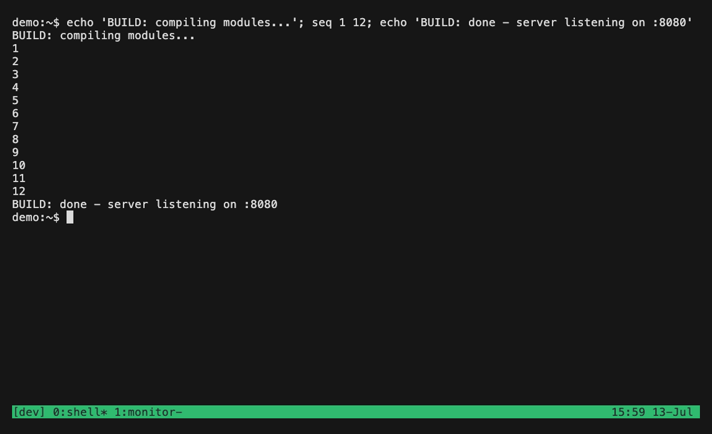

<h2>
  <picture>
    <source media="(prefers-color-scheme: dark)" srcset="./docs/public/assets/logo-white.svg">
    
  </picture>
  &nbsp;&nbsp;&nbsp;lazy-tmux
</h2>

[](https://github.com/alchemmist/lazy-tmux/actions/workflows/quality-graph.yml)
[](https://github.com/alchemmist/lazy-tmux/releases/latest)
[](https://github.com/alchemmist/homebrew-tap)
[](https://aur.archlinux.org/packages/lazy-tmux)
[](https://hub.docker.com/r/alchemmist/lazy-tmux)
[](go.mod)
[](LICENSE)
[](https://lazy-tmux.xyz/installation/)

Project architect: [@alchemmist](https://github.com/alchemmist)

CLI written in Go for saving and restoring tmux sessions lazily. Key features:

- Save sessions: current, specific, or all — including windows, panes, layouts, running commands, and scrollback history.
- Lazy restore: restore only what you need, avoiding high RAM usage.
- Autosave daemon: periodically snapshots all sessions in the background (single instance, no conflicts).
- Interactive TUI browser: tree view (sessions/windows) + table (commands, snapshot time, counts, status) with fuzzy search.
- Keyboard-driven picker for fast search, navigation, and manage sessions and windows directly inside picker tree.
- Lightweight `picker --sessions-only` mode for Alt-Tab-style switching in a narrow tmux popup.
- In the picker, press `Option/Alt` + a window number (`1`, `2`, `3`, …) to immediately restore the first matching window from the current results.
- Independent Codex, Antex, and Claude Code integrations preserve the agent identity and exact conversation. Verified Antex bindings remain compatible; Codex and Claude require explicitly installed lifecycle hooks. Unverified conversations are never guessed from directory recency.
- Flexible sorting via `--session-sort` or `--window-sort` (by last-used, time, size, name, command, etc.).
- Optional `fzf` integration via `--fzf-engine` (lighter and no dependencies binary, but without full keyboard control and TUI picker); add `--windows` to pick a specific window instead of a whole session.
- Bootstrap restore on tmux startup: auto-restore latest or specific session.
- Full environment snapshots: restore pane layout and commands (e.g. `npm`, `docker-compose`, `nvim`).
- Optional scrollback capture: preserve and replay previous terminal output.

Save your sessions, kill the entire tmux server, then bring everything back from the TUI picker:



Check out [lazy-tmux.xyz](https://lazy-tmux.xyz) for more information about installation and usage!

Just for building from source you need to have installed go and cloned this project. After that run:

```bash
make build
```

Binary will be compiled in `bin/lazy-tmux`. For more development options check out `Makefile` tasks.

> [!NOTE]
> **tmux versions:** lazy-tmux supports every tmux release from **2.9 through 3.7b**,
> verified on each one by the CI version matrix. Newer releases are added as they ship.

For configuration, CLI reference, and usage, see the docs at
[lazy-tmux.xyz](https://lazy-tmux.xyz).

## Agent integrations

Codex, Antex, and Claude Code are independent clients. Their commands, configuration homes, conversation IDs and statuses never migrate to another client automatically. Each has its own `enabled` and `home` settings under `[integrations.codex]`, `[integrations.antex]` and `[integrations.claude]`.

Antex publishes a native binding (Antex 0.1.8+; 0.1.9+ also publishes startup receipts). Existing verified Antex snapshots work without reconfiguration.

For Codex and Claude, install lifecycle hooks once using an installed, stable lazy-tmux executable:

```sh
lazy-tmux integrations setup codex
lazy-tmux integrations setup claude
lazy-tmux integrations doctor
lazy-tmux agent-session --agent codex --pane %1
```

Codex uses `<home>/hooks.json`; Claude uses `<home>/settings.json`. The installer preserves other hooks and settings, keeps a `.lazy-tmux.bak` backup, and supports `--uninstall`. `claude-hooks` remains a compatibility command for the new setup. Review and trust installed hooks inside the client: installation does not bypass client trust or administrator policies. Older `hook claude-status` files are not used for identity or status.

Hooks must execute as descendants of the local client that owns the tmux pane. A daemon, remote app-server, nested agent, suspended process or reused PID cannot claim a panel without ownership proof. Unsupported launch flags are rejected rather than discarded. Supported profile/model and other known launch options retain argument boundaries, including paths with spaces. Initial prompts and images are not replayed. Current runtime settings should be persisted by the client; launch options describe the original invocation.

The picker displays `?` when an agent has no verified identity and `↻` when restoration is pending. Run `integrations doctor` for setup and per-pane details. A missing live status stays unknown. Hook status updates for another conversation do not modify the current panel.

### Old snapshots and recovery

Snapshot format 2 stores the agent and restoration arguments explicitly and continues to read format 1. There is no automatic `codex` to `antex` conversion. Existing snapshots already rewritten by older releases cannot be classified reliably without the original backup or user knowledge.

Legacy unverified IDs require explicit repair. Preview first, then repeat with `--apply`:

```sh
lazy-tmux integrations repair --session work --window 1 --pane 0 --agent codex --id EXACT_ID
lazy-tmux integrations repair --session work --window 1 --pane 0 --agent codex --id EXACT_ID --apply
```

Repair changes only the selected saved pane and writes `.pre-agent-repair.bak` before applying. It does not start or stop clients or claim that a live process was verified. Use repair on an offline session so autosave cannot overwrite a manual edit. Normal autosave also preserves unverified legacy snapshots in `.pre-binding-v1.bak`. Keep these backups until recovery is complete; do not downgrade a writer against format-2 snapshots.

Restoration keeps the original intent until a matching startup receipt or a verified live binding is observed. Startup failures leave the intended conversation available for retry rather than replacing it with a shell snapshot. This applies to all three clients.

### Verification levels

`make check` covers all adapters through replayed lifecycle events and real isolated tmux processes, including multiple clients sharing a working directory. These tests require no accounts; they do not certify actual upstream client versions.

`make real-agent-test` is a separate opt-in smoke test using actual installed `codex` and `claude`. It starts a new conversation and verifies restoration of the same ID. It requires dedicated authenticated client homes, hooks installed and trusted there, and exact version output strings:

- `LAZY_TMUX_REAL_CODEX_HOME` and `LAZY_TMUX_REAL_CODEX_VERSION`
- `LAZY_TMUX_REAL_CLAUDE_HOME` and `LAZY_TMUX_REAL_CLAUDE_VERSION`

Each dedicated home must contain `.lazy-tmux-test-home` with `codex` or `claude`, respectively. Never point the test at your normal client home. The target fails when required inputs are missing; the ordinary suite explicitly skips these credential-dependent tests. No Codex/Claude client version is certified solely by the replay tests. The current implementation follows [Codex hooks](https://learn.chatgpt.com/docs/hooks) and [Claude Code hooks](https://code.claude.com/docs/en/hooks); unsupported versions, missing trust and unprovable daemon ownership are reported as unverified.
