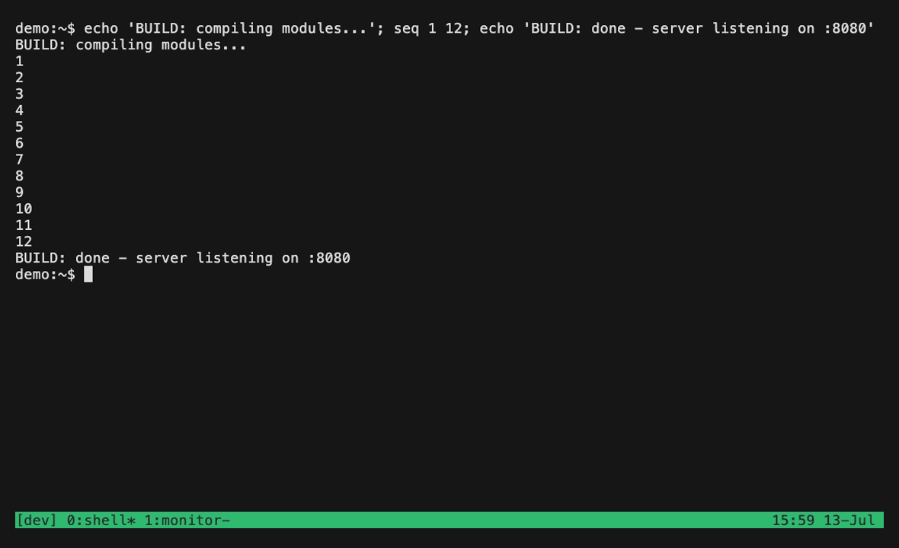

<h2>
  <picture>
    <source media="(prefers-color-scheme: dark)" srcset="./docs/public/assets/logo-white.svg">
    
  </picture>
  &nbsp;&nbsp;&nbsp;lazy-tmux
</h2>

[English](README.md) | 简体中文 | [日本語](README.ja.md)

![Static Badge](https://img.shields.io/badge/website-red?style=flat&logo=data%3Aimage%2Fsvg%2Bxml%3Bbase64%2CPD94bWwgdmVyc2lvbj0iMS4wIiA%2FPgoNPCEtLSBVcGxvYWRlZCB0bzogU1ZHIFJlcG8sIHd3dy5zdmdyZXBvLmNvbSwgR2VuZXJhdG9yOiBTVkcgUmVwbyBNaXhlciBUb29scyAtLT4KPHN2ZyBmaWxsPSIjMDAwMDAwIiB3aWR0aD0iODAwcHgiIGhlaWdodD0iODAwcHgiIHZpZXdCb3g9IjAgMCA0MDAgNDAwIiBpZD0iTmlnaHQiIHZlcnNpb249IjEuMSIgeG1sOnNwYWNlPSJwcmVzZXJ2ZSIgeG1sbnM9Imh0dHA6Ly93d3cudzMub3JnLzIwMDAvc3ZnIiB4bWxuczp4bGluaz0iaHR0cDovL3d3dy53My5vcmcvMTk5OS94bGluayI%2BCg08ZyBpZD0iWE1MSURfNDJfIj4KDTxwb2x5Z29uIGlkPSJYTUxJRF80NF8iIHBvaW50cz0iMTMzLjMsNTMuMyAxMzMuMywyNi43IDEwNi43LDI2LjcgODAsMjYuNyA4MCw1My4zIDEwNi43LDUzLjMgICIvPgoNPHBvbHlnb24gaWQ9IlhNTElEXzY0XyIgcG9pbnRzPSIxNjAsNTMuMyAxODYuNyw1My4zIDE4Ni43LDI2LjcgMjEzLjMsMjYuNyAyMTMuMywwIDE4Ni43LDAgMTYwLDAgMTMzLjMsMCAxMzMuMywyNi43IDE2MCwyNi43ICAgICAiLz4KDTxyZWN0IGhlaWdodD0iMjYuNyIgaWQ9IlhNTElEXzY1XyIgd2lkdGg9IjI2LjciIHg9IjUzLjMiIHk9IjUzLjMiLz4KDTxyZWN0IGhlaWdodD0iMjYuNyIgaWQ9IlhNTElEXzY2XyIgd2lkdGg9IjI2LjciIHg9IjEzMy4zIiB5PSI1My4zIi8%2BCg08cG9seWdvbiBpZD0iWE1MSURfOTBfIiBwb2ludHM9IjEwNi43LDEwNi43IDEwNi43LDEzMy4zIDEwNi43LDE2MCAxMDYuNywxODYuNyAxMDYuNywyMTMuMyAxMzMuMywyMTMuMyAxMzMuMywxODYuNyAxMzMuMywxNjAgICAgMTMzLjMsMTMzLjMgMTMzLjMsMTA2LjcgMTMzLjMsODAgMTA2LjcsODAgICIvPgoNPHBvbHlnb24gaWQ9IlhNTElEXzkxXyIgcG9pbnRzPSI1My4zLDEwNi43IDUzLjMsODAgMjYuNyw4MCAyNi43LDEwNi43IDI2LjcsMTMzLjMgNTMuMywxMzMuMyAgIi8%2BCg08cG9seWdvbiBpZD0iWE1MSURfOTJfIiBwb2ludHM9IjM3My4zLDE4Ni43IDM3My4zLDIxMy4zIDM0Ni43LDIxMy4zIDM0Ni43LDI0MCAzNzMuMywyNDAgMzczLjMsMjY2LjcgNDAwLDI2Ni43IDQwMCwyNDAgICAgNDAwLDIxMy4zIDQwMCwxODYuNyAgIi8%2BCg08cG9seWdvbiBpZD0iWE1MSURfOTNfIiBwb2ludHM9IjI2LjcsMjEzLjMgMjYuNywxODYuNyAyNi43LDE2MCAyNi43LDEzMy4zIDAsMTMzLjMgMCwxNjAgMCwxODYuNyAwLDIxMy4zIDAsMjQwIDAsMjY2LjcgICAgMjYuNywyNjYuNyAyNi43LDI0MCAgIi8%2BCg08cmVjdCBoZWlnaHQ9IjI2LjciIGlkPSJYTUxJRF85NF8iIHdpZHRoPSIyNi43IiB4PSIxMzMuMyIgeT0iMjEzLjMiLz4KDTxyZWN0IGhlaWdodD0iMjYuNyIgaWQ9IlhNTElEXzk1XyIgd2lkdGg9IjI2LjciIHg9IjE2MCIgeT0iMjQwIi8%2BCg08cmVjdCBoZWlnaHQ9IjI2LjciIGlkPSJYTUxJRF85Nl8iIHdpZHRoPSIyNi43IiB4PSIzMjAiIHk9IjI0MCIvPgoNPHBvbHlnb24gaWQ9IlhNTElEXzk3XyIgcG9pbnRzPSI1My4zLDI2Ni43IDI2LjcsMjY2LjcgMjYuNywyOTMuMyAyNi43LDMyMCA1My4zLDMyMCA1My4zLDI5My4zICAiLz4KDTxwb2x5Z29uIGlkPSJYTUxJRF85OF8iIHBvaW50cz0iMjEzLjMsMjkzLjMgMjQwLDI5My4zIDI2Ni43LDI5My4zIDI5My4zLDI5My4zIDMyMCwyOTMuMyAzMjAsMjY2LjcgMjkzLjMsMjY2LjcgMjY2LjcsMjY2LjcgICAgMjQwLDI2Ni43IDIxMy4zLDI2Ni43IDE4Ni43LDI2Ni43IDE4Ni43LDI5My4zICAiLz4KDTxwb2x5Z29uIGlkPSJYTUxJRF85OV8iIHBvaW50cz0iMzQ2LjcsMjkzLjMgMzQ2LjcsMzIwIDM3My4zLDMyMCAzNzMuMywyOTMuMyAzNzMuMywyNjYuNyAzNDYuNywyNjYuNyAgIi8%2BCg08cmVjdCBoZWlnaHQ9IjI2LjciIGlkPSJYTUxJRF8xMDBfIiB3aWR0aD0iMjYuNyIgeD0iNTMuMyIgeT0iMzIwIi8%2BCg08cmVjdCBoZWlnaHQ9IjI2LjciIGlkPSJYTUxJRF8xMDFfIiB3aWR0aD0iMjYuNyIgeD0iMzIwIiB5PSIzMjAiLz4KDTxwb2x5Z29uIGlkPSJYTUxJRF8xMDJfIiBwb2ludHM9IjEwNi43LDM0Ni43IDgwLDM0Ni43IDgwLDM3My4zIDEwNi43LDM3My4zIDEzMy4zLDM3My4zIDEzMy4zLDM0Ni43ICAiLz4KDTxwb2x5Z29uIGlkPSJYTUxJRF8xMDNfIiBwb2ludHM9IjI2Ni43LDM0Ni43IDI2Ni43LDM3My4zIDI5My4zLDM3My4zIDMyMCwzNzMuMyAzMjAsMzQ2LjcgMjkzLjMsMzQ2LjcgICIvPgoNPHBvbHlnb24gaWQ9IlhNTElEXzEwNF8iIHBvaW50cz0iMjEzLjMsMzczLjMgMTg2LjcsMzczLjMgMTYwLDM3My4zIDEzMy4zLDM3My4zIDEzMy4zLDQwMCAxNjAsNDAwIDE4Ni43LDQwMCAyMTMuMyw0MDAgMjQwLDQwMCAgICAyNjYuNyw0MDAgMjY2LjcsMzczLjMgMjQwLDM3My4zICAiLz4KDTwvZz4KDTwvc3ZnPg%3D%3D&color=%23add8e6&link=https%3A%2F%2Flazy-tmux.xyz)


[](https://github.com/alchemmist/lazy-tmux/actions/workflows/build.yml)

项目架构师：[@alchemmist](https://github.com/alchemmist)

一款使用 Go 编写的 CLI，用于以惰性方式保存和恢复 tmux 会话。主要功能：

- 保存当前、指定或全部会话，包括窗口、窗格、布局、正在运行的命令和回滚历史。
- 惰性恢复：只恢复所需内容，避免占用大量内存。
- 自动保存守护进程：定期在后台为所有会话创建快照（单一实例，无冲突）。
- 交互式 TUI 浏览器：树状视图（会话/窗口）+ 表格（命令、快照时间、数量、状态），并支持模糊搜索。
- 键盘驱动的选择器，可直接在选择器树中快速搜索、导航和管理会话与窗口。
- 通过 `--session-sort` 或 `--window-sort` 灵活排序（按最近使用、时间、大小、名称、命令等）。
- 可选的 `fzf` 集成可通过 `--fzf-engine` 启用（更轻量且二进制文件无依赖，但不支持完整键盘控制和 TUI 选择器）；添加 `--windows` 可选择特定窗口，而不是整个会话。
- tmux 启动时进行引导恢复：自动恢复最新会话或指定会话。
- 完整环境快照：恢复窗格布局和命令（例如 `npm`、`docker-compose`、`nvim`）。
- 可选的回滚内容捕获：保留并重放以前的终端输出。

保存会话，终止整个 tmux 服务器，然后通过 TUI 选择器恢复所有内容：



有关安装和使用的更多信息，请访问 [lazy-tmux.xyz](https://lazy-tmux.xyz)！

仅从源代码构建时，需要安装 Go 并克隆本项目。然后运行：

```bash
make build
```

二进制文件将编译到 `bin/lazy-tmux`。有关更多开发选项，请查看 `Makefile` 中的任务。

> [!NOTE]
> **tmux 版本：** lazy-tmux 支持从 **2.9 到 3.7b** 的所有 tmux 版本，
> 并通过 CI 版本矩阵逐一验证。新版本发布后也会加入支持。

有关配置、CLI 参考和使用方法，请参阅
[lazy-tmux.xyz](https://lazy-tmux.xyz) 上的文档。
